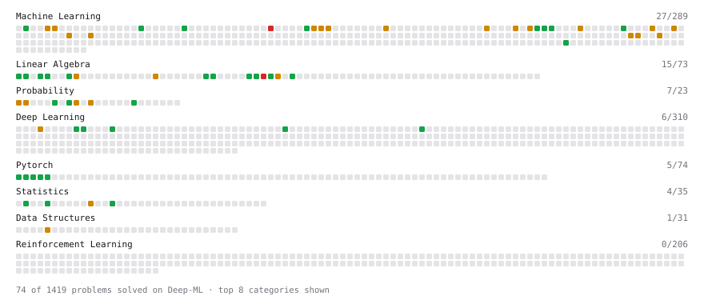

# Deep-ML

My machine learning practice from [Deep-ML](https://www.deep-ml.com). Every solution here was written by hand.

**1** solved · 0 problems · 0 labs · 1 math

[**Browse the interactive portfolio**](https://Zakria0.github.io/deep-ml/) to replay this filling in over time.

## Math

| | Difficulty | Solved | |
| --- | --- | --- | --- |
| [Model Selection: CV, AIC, and BIC](https://www.deep-ml.com/math-problems/43) | easy | 2026-09-15 | [solution](math/0043-model-selection-cv-aic-and-bic) |

---

_This file is regenerated by Deep-ML on every push._
